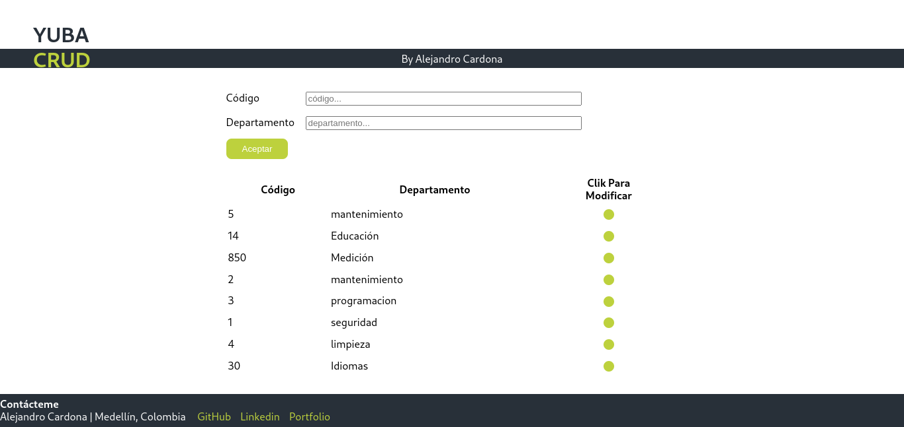
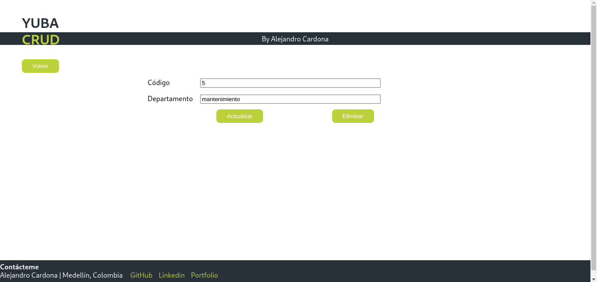

# YUBA-CRUD-Project
Esta apliacación es de tipo CRUD que opera en el front con React, axios para el manejo de funciones asincrónicas y react-touter-dom para el manejo de direccionamiento. Por su lado, el back lo comprenden Express, sequelize y una RDBMS postgres, base de datos que trabaja con una tabla única de tres campos pero solo dos con los que pueden interactuar el usuario de la app, además el uso de librerias adicionales que se destinaron a un par de test unitarios.

# Pasos Para instalar una aplicación CRUD en tu PC

 

## 1. Verificación de dependencias iniciales
Verificar o instalar npm, node y postgres. 
### Nota: Recordar tener GIT instalado con anticipación.

### 1.1 
Para verificar, primero copiar y pegar cada uno de los comandos en la terminal de su computadora.

### `node -v`
### `npm -v`
### `psql -V`

### 1.2 
Si no encuentra el versionado o no hay respuesta, se procede a instalar.

### 1.2.1
nodejs viene acompañado con npm. Revisar distribución y plataforma para descargar la opción correcta en https://nodejs.org/en/download/

### 1.2.1 
para postgres se debe realizar la misma revision y encontrar el instalador indicado en https://www.postgresql.org/download/

 

## 2. Copia de repositorio
Clonamos repositorio usando el comando en la terminal de linea de comandos
### `git clone https://github.com/alejoOxono/YUBA-CRUD-Project`

 

## 3. Preparamos bases de datos
Crear usuario con su contraseña y bases de datos en postgres para la conexión con el servidor.

### Nota: Si se desea usar usuario y bases de datos propia. Para esto modificar variables en el archivo `api/src/db.js`
#### `En DB_USER`  indicar el usuario creado en postgres
#### `En DB_PASSWORD`  indicar contraseña para el usuario
#### `En DB_BDNAME` indicar el nombre de la base de datos

### Para crear todo a partir de 0 desde la terminal escribir los siguientes comandos.

### 3.1
Conectar con postgres y crear usuario que para este caso la aplicación lo necesita con el nombre de `triquiuser`

### `sudo -i -u postgres`
### `createuser --interactive`
### `Enter name of role to add: userpruebayuba`
### `Shall the new role be a superuser? (y/n) y`
### NOTA: El usuario creado por razones de simplicidad es un super usuario, lo que no es recomendable. Así, que luego de probar la aplicación se recomienda eliminar el usuario con los comandos
### `sudo -i -u postgres`
### `psql`
### `DROP DATABASE dbpruebayuba;`
### `DROP USER userpruebayuba;`

### 3.2
Cambiar contraseña para el usuario recien creado `userpruebayuba` que por defecto la aplicación necesita de la contraseña `passpruebayuba` y crear la base de datos que debe de llevar el nombre `dbpruebayuba`

### `psql`
### `ALTER USER userpruebayuba PASSWORD 'passpruebayuba';`
### `CREATE DATABASE dbpruebayuba;`

 

## 4. Instalar dependencias para el servidor y el cliente.
Para los siguientes pasos e incluso para el punto siguiente(#5) se debe de usar nuevamente la linea de comandos, usando dos terminales y estar respectivamente en los siguientes directorios:

### Para el servidor `API_NodeJS`
### Para el cliente `client`

### 4.1
Instalar dependencias que son necesarias del package.json para cada uno de los directorios anteriormente especificados
### `npm i` ubicado en `API_NodeJS`
### `npm i` ubicado en `client`

 

## 5. Ejecutar servidor y aplicativo
Como se hizo en el punto anterior, con dos terminales de comando ubicadas en el directorio `API_NodeJS` y `client` respectivamente seguir los siguientes pasos

### 5.1
Para el servidor ubicado en `API_NodeJS`, ingresar
### `npm start`

### 5.2
Para el front ubicado en `client`, ingresar
### `npm start`

 
Si llegaste a este paso YA PUEDES TRABAJAR Y PROBAR la aplicación. Muchas Gracias Por Probarla y buena suerte.
